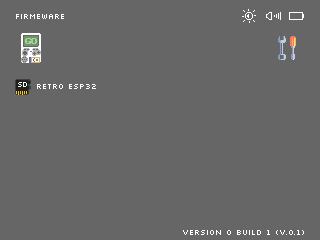
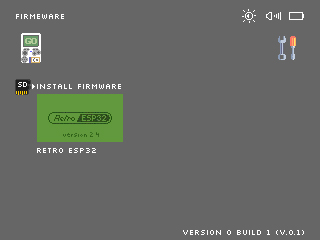
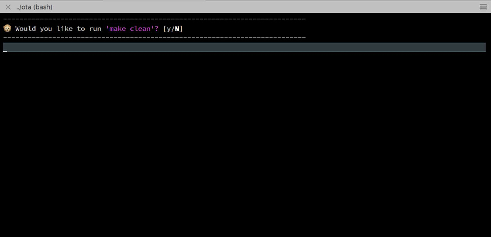
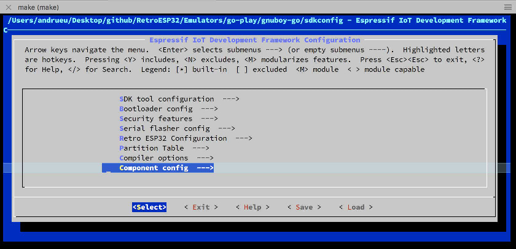
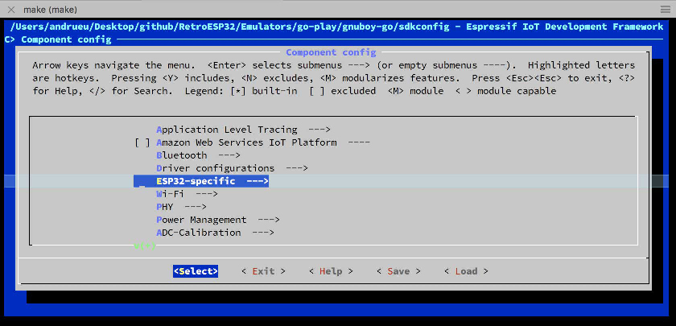
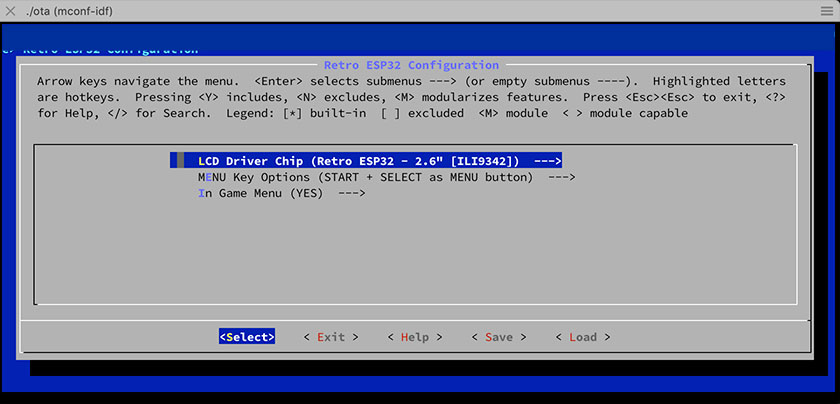
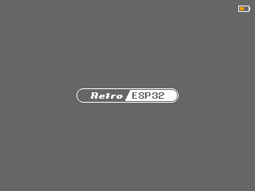

# 
> DIY - Build It Yourself

If you are considering / curious about the build process of the Retro ESP Launcher, you will need a few things to prepare

## Preperation
> Git going

Clone the **Master** [Official Retro ESP32](https://github.com/retro-esp32/RetroESP32/) repo

```shell
git clone -b master --single-branch git@github.com:retro-esp32/RetroESP32.git --recursive
cd RetroESP32
git submodule update --init --recursive
git submodule foreach git pull origin master
chmod -R 777 Scripts
cd Scripts
./installer
```

It will take a while since we run a few ```git submodule``` inside the repository

## Toolchain
> You will need the xtensa esp32 toolchain

***Note:*** You only need to install the xtensa toolchain. The esp-idf is included in this repository.

- [Linux](https://docs.espressif.com/projects/esp-idf/en/latest/get-started/linux-setup.html)
- [Mac OS](https://docs.espressif.com/projects/esp-idf/en/latest/get-started/macos-setup.html)
- [Windows](https://docs.espressif.com/projects/esp-idf/en/latest/get-started/windows-setup-scratch.html)


## Bash Scripts
> Some tools to help you along your way

Navigate to you newly cloned repository and execute the following
```
chmod -R 777 Scripts
cd Scripts
```

***Note:*** All bash scripts **MUST** be executed from the Scripts folder.


### Submodule Branches
> Make sure all the submodules are on the right branches

```
./branches
```

### Replace files for ILI9342 drivers
> Copy relevant files for ILI9342 TFT LCD

```
./replace
```

### ESP32 Environment Installer
> Install all thing necessary (NIX/OS X)  *Windows Coming Soon*

```
./installer
```

### Environmanet Variables
> Set all your paths
> Be sure to run installer first

```
source ./helpers/paths
```

### Build Firmware
> Follow Onscreen Prompts
> if this is your first time running the executable, answer **Y** to the options

```
./firmware
```

You will now have a file called **Retro ESP32.fw** in the Firmware/Release folder.

You can copy this onto your *SD Card* into the ***odroid/firmware*** folder

##### Enabling new firmware
> Insert the sd card into your Retro ESP32 /  (Odroid Go) and follow the prompts

| Boot| Settings| List| Select| Write| Reboot|
| ----- | ----- | ----- | ----- | ----- | ----- |
|  |  |  |  |  |  |

### Build and Load OTA
> Follow Onscreen Prompts
> if this is your first time running the executable, answer **Y** to the applicable options

### OTA
> Flash directly to ESP32

This is the easiest option, simple follow the onscreen prompts!

```
./ota
```

*note:*

You will need to set the SPI ram for the emulators

| Screen Grab                               | Instructions                                                 |
| ----------------------------------------- | ------------------------------------------------------------ |
|  | Answer **Y**                                                 |
|  | Answer **N**                                                 |
|  | Answer **Y** (This is IMPORTANT)                             |
|  | Navigate to ```Component config -->```                       |
|  | Navigate to ```ESP32-specific -->```                         |
|  | Navigate to ```SPI RAM config -->```                         |
|  | Navigate to ```Type of SPI RAM chip in use (some value) -->``` |
|  | Select ```Auto-detect```                                     |


### Erase

> Erase flash and storage from ESP32

```
./erase
```

### Arduino
> Create Firmware from Arduino ```.ino.bin``` file

```
./arduino
```

You will now have a ```.fw``` file in Arduino/firmware folder.

You can copy this onto your *SD Card* into the ***odroid/firmware*** folder


### 
# Retro ESP32
> Software Branch

Finally a new launcher for your Odroid-Go

```
cd Launchers/retro-esp32
make menuconfig
```

1. Select ```Restro ESP32 Configuration``` 

2. Select your options
  * *Select* **LCD Driver Chip**
  * *Select* **MENU Key Options**
  * *Select* **In Game Menu**

3. Run ```./ota```  (see above)

| Splash                          | Navigation                     | ROM State Management             | Run                          |
| ------------------------------- | ------------------------------ | -------------------------------- | ---------------------------- |
|  |  |  |  |

-----

> ## Although we do this for 💕 of 🕹️
> **We Also Like Coffee!**
> *Please Consider Supporting*<br>
> [](https://github.com/sponsors/retro-esp32)

-----