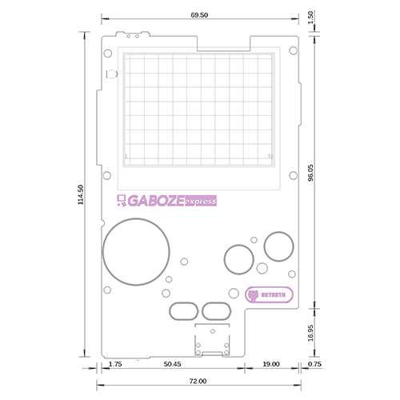
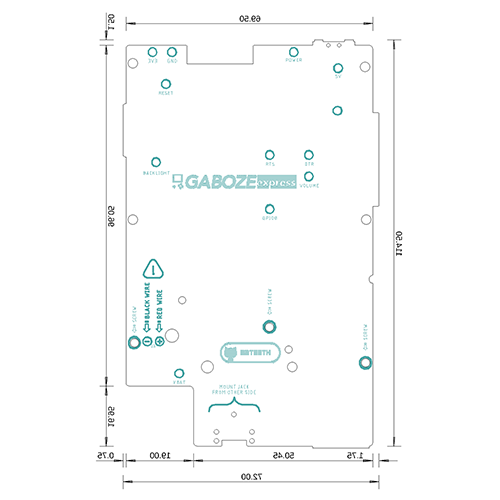
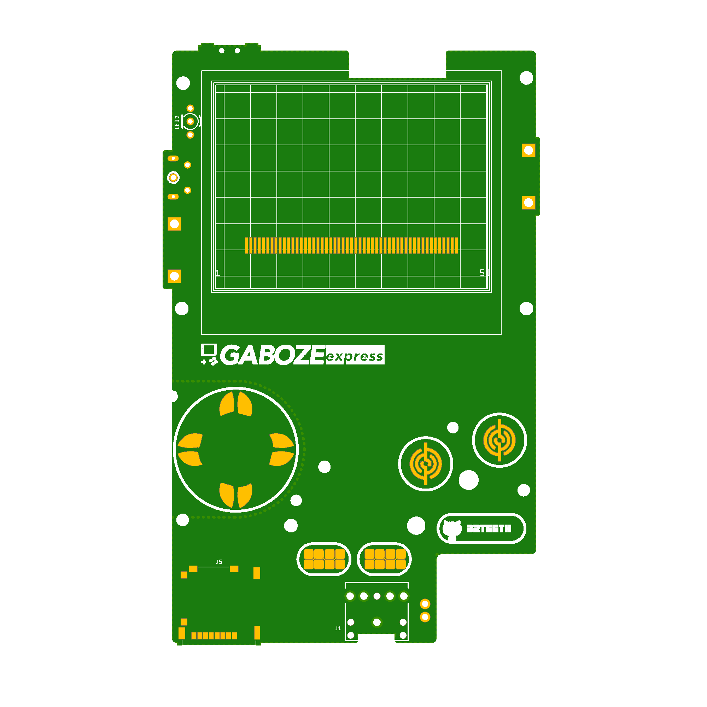
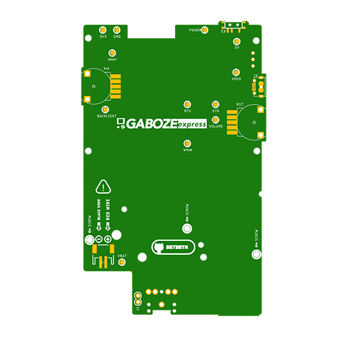
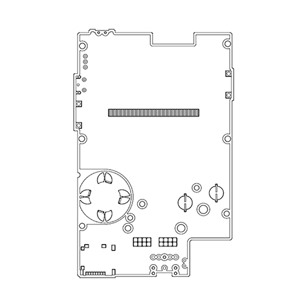
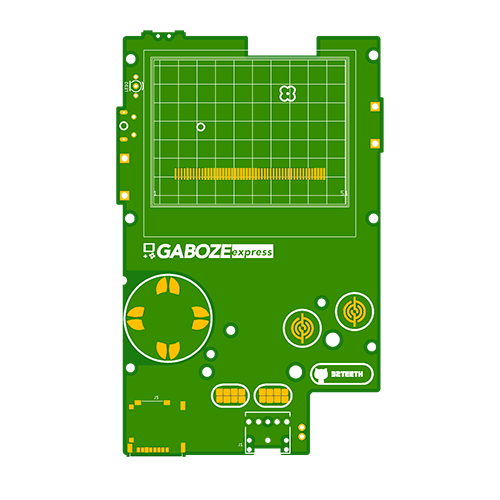
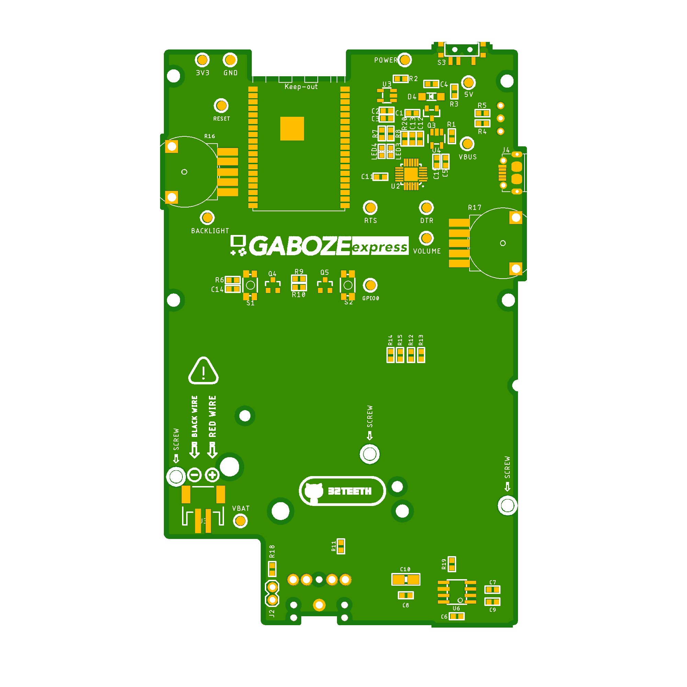
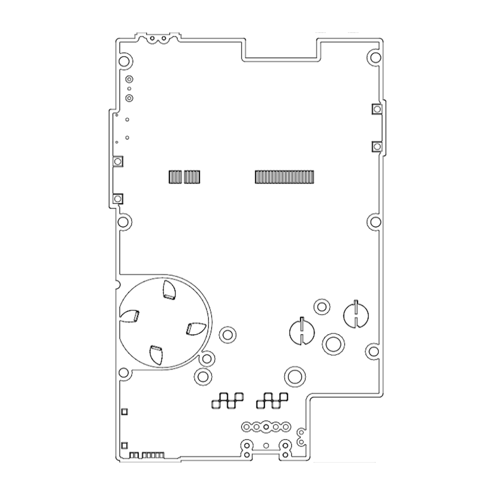

# 
> Hardware Branch

### Measurements

| Top Measurements | Bottom Measurement |
| ------------------ | ---------------- |
|  |  |

### Layout

| Top Layout | Bottom Layout |
| ------------------ | ---------------- |
|  |  |

#### DXF

| Top Layout | Bottom Layout |
| ------------------ | ---------------- |
|  |  |

### Placement (Unofficial)

| Top Layout | Bottom Layout |
| ------------------ | ---------------- |
|  |  |

#### DXF

| Top Layout | Bottom Layout |
| ------------------ | ---------------- |
|  |  |

