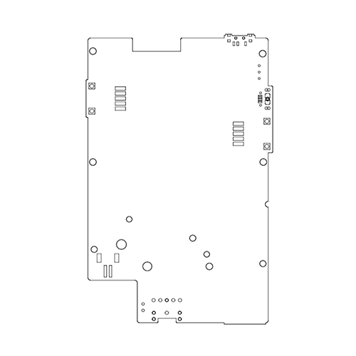
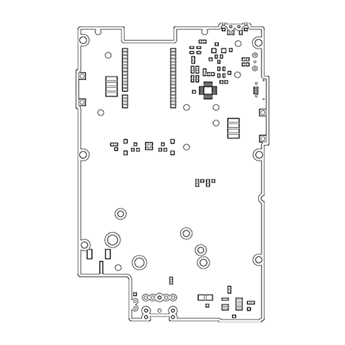

# 
> Hardware Branch

## UPDATE!!!

### Hardware
> Testing FTDI Solution

Thanks to a recent contribution, we will be testing out the replacement of the CP2104 USB to UART bridge IC with an FTDI FT232RL IC

The FTDI IC is more hand solder friendly than the CP210x QFN series

Here is a teaser of what we are testing

| Top Layout | Bottom Layout |
| ------------------ | ---------------- |
|  |  |

### Measurements

| Top Measurements | Bottom Measurement |
| ------------------ | ---------------- |
|  |  |

### Layout

| Top Layout | Bottom Layout |
| ------------------ | ---------------- |
|  |  |

#### DXF

| Top Layout | Bottom Layout |
| ------------------ | ---------------- |
|  |  |

### Placement (Unofficial)

| Top Layout | Bottom Layout |
| ------------------ | ---------------- |
|  |  |

#### DXF

| Top Layout | Bottom Layout |
| ------------------ | ---------------- |
|  |  |

