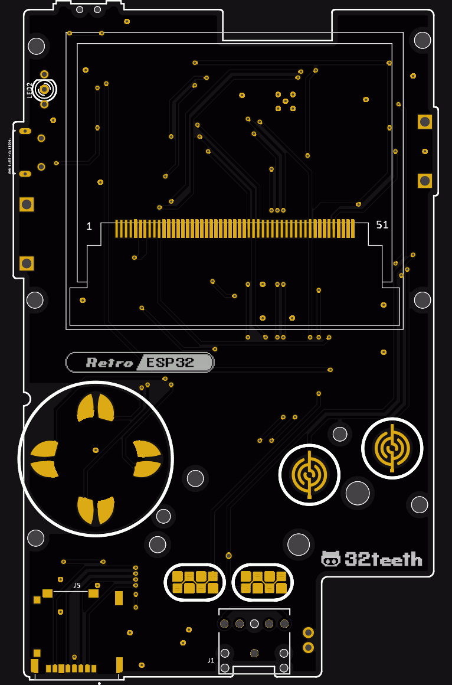

------

#### Buy Us A Coffee
> It's Not Mandatory, But Much [Appreciated](https://www.paypal.me/32teeth/1.99USD)

We work tirelessly to bring you the best **Odroid GO** and **Retro ESP32** user experience.

Everything we provide is free to use, Feedback is always welcome.

If you like what you see, and feel like giving us additional support, we accept **PayPal** donation of $1.99 USD, that's like, 1 coffee. But fee free to change the amount. We won't shy away!

*Thank You*
Retro ESP32 Team

------

# 
> An ESP32 Wrover based Game Boy Pocket ** Hardware Branch **

## Gerbers
> You can use the Gerber Files to check your production

*note:* PCB thickness must be 1mm

## BOM
> Full Bom Available

*note:* LCD and Thumbwheels have AliExpress Links

### Eagle Library
> We use a Managed Library

[RetroESP32](urn:adsk.eagle:library:12566846)

### Hardware
> FTDI Solution

Thanks to a recent contribution, we will be testing out the replacement of the CP2104 USB to UART bridge IC with an FTDI FT232RL IC

The FTDI IC is more hand solder friendly than the CP210x QFN series

Here is a teaser of what we are testing

| Top Layout | Bottom Layout |
| ------------------ | ---------------- |
|  |  |

